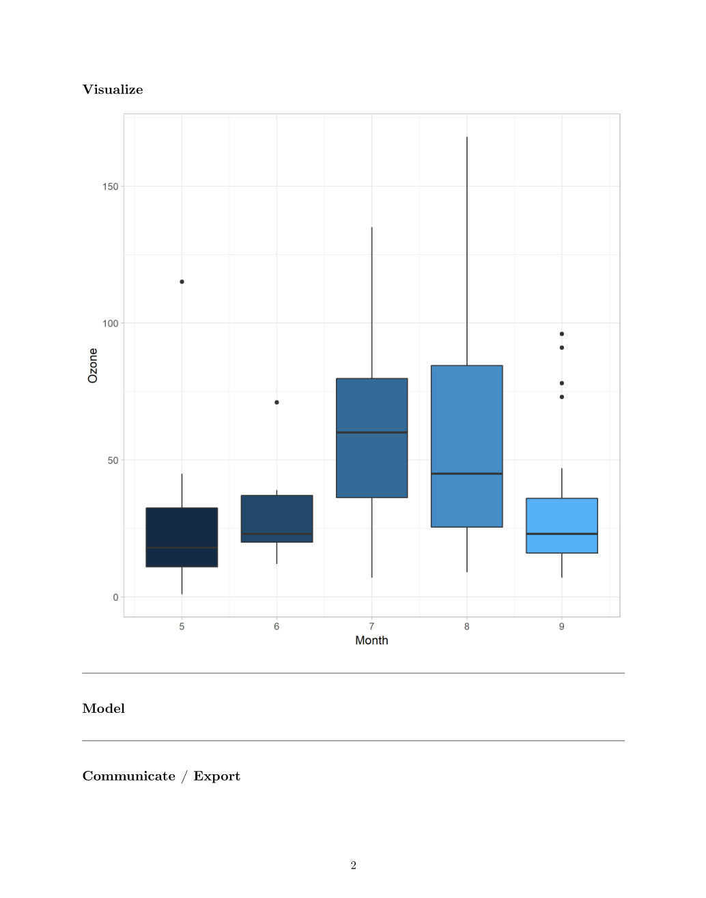
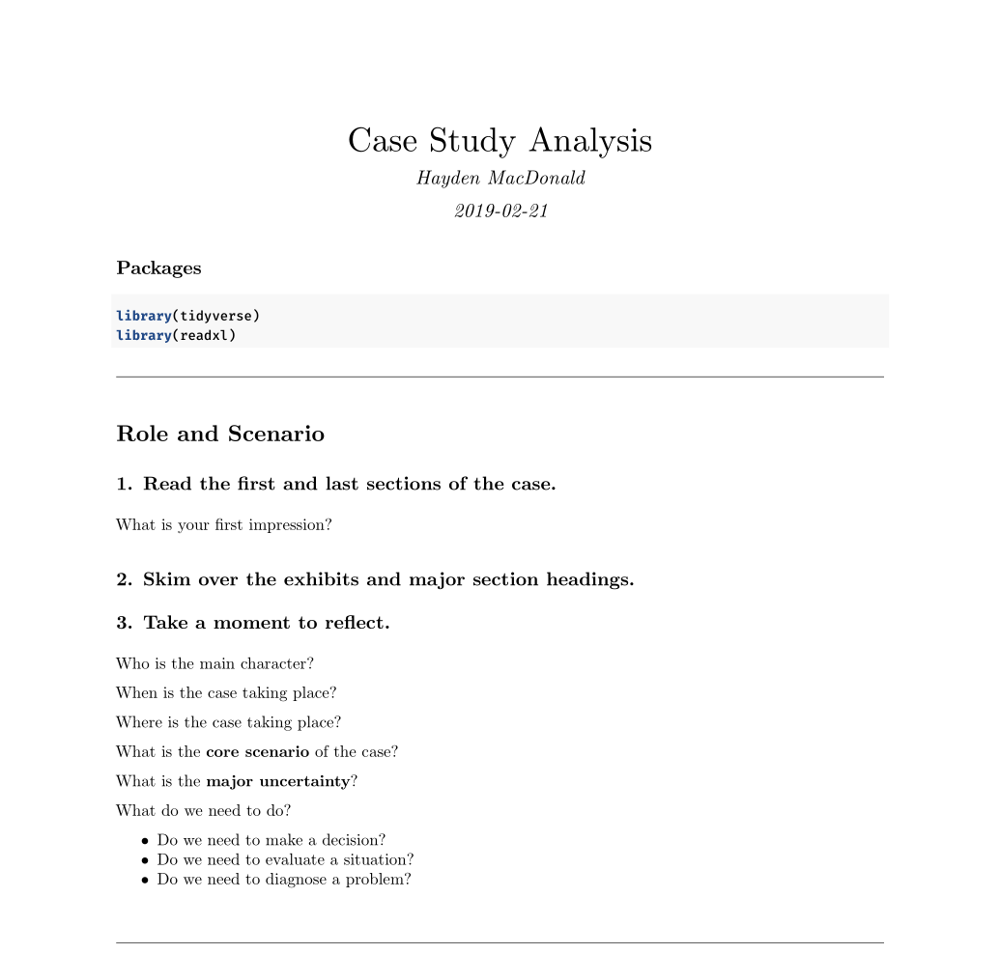
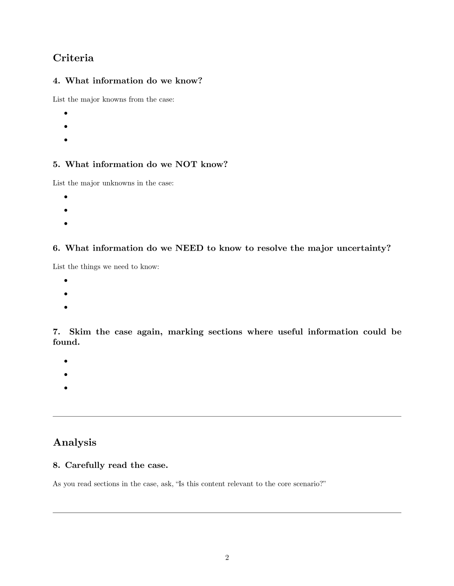
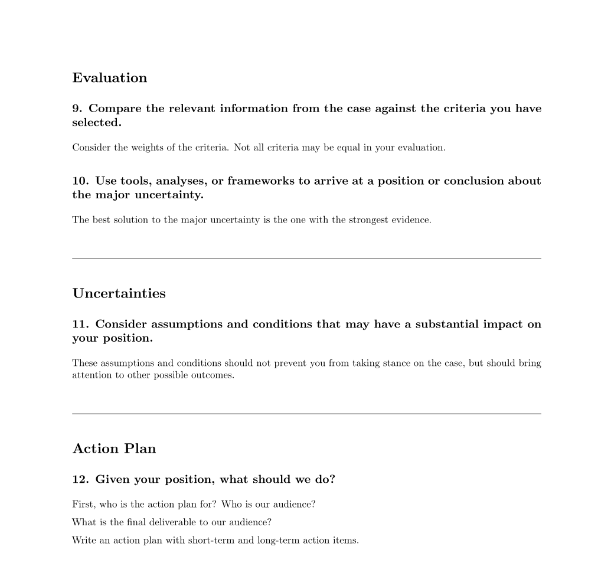

# HMDRMD

This is a collection of R Markdown templates created for data analysis project workflows including:

- Tidy Analysis
- Case Study Analysis

## Installation

```{r}
if (!requireNamespace("devtools")) install.packages("devtools")

devtools::install_github("HaydenMacDonald/hmdrmd")
```

## Templates

### Tidy Analysis

A basic template for tidy data analysis for educational or professional use. This R Markdown file outputs a pdf for reporting results.

The document is broken into six sections, including:  
- Packages
- Import
- Wrangle
- Visualize
- Model
- Communicate / Export 

### Example of Tidy Analysis template




### Case Study Analysis

R Markdown template for case study analyses based on William Ellet's case study guide in <a href="https://hbr.org/product/the-case-study-handbook-revised-edition-a-student-s-guide/10208E-KND-ENG" target = "_blank">*The Case Study Handbook, Revised Edition: A Student's Guide* (2018)</a><sup>[1](#myfootnote1)</sup>. This template is intended to be used by students in educational and research environments involving case analyses.  

This R Markdown file outputs a pdf report with settings adjusted in a setup chunk.  

The document contains 9 essential questions for case study analysis, separated into 6 sections:  
- Role and Scenario
- Criteria
- Analysis
- Evaluation
- Uncertainties
- Action Plan 

### Example of Case Study Analysis template





## Help

Submit issues here on GitHub.  

If you are interested in extending the functionality of this package, fork this repository, make your changes and submit them as a pull request.  

## Footnotes

<a name="myfootnote1">1</a>: Ellet, W. (2018). *The case study handbook, revised edition: A student's guide*. Boston, Massachussets, Harvard Business Review Press.
